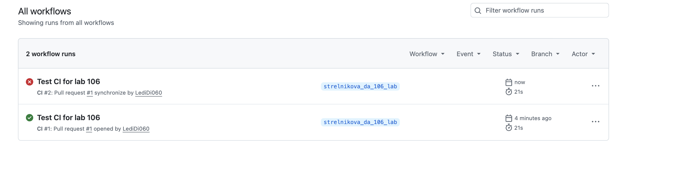
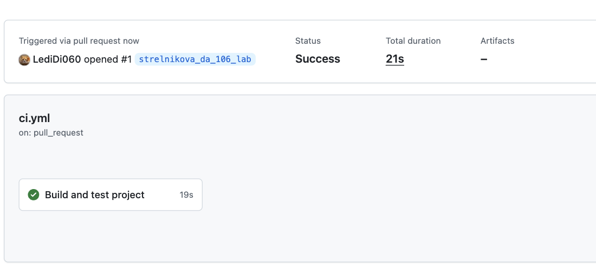
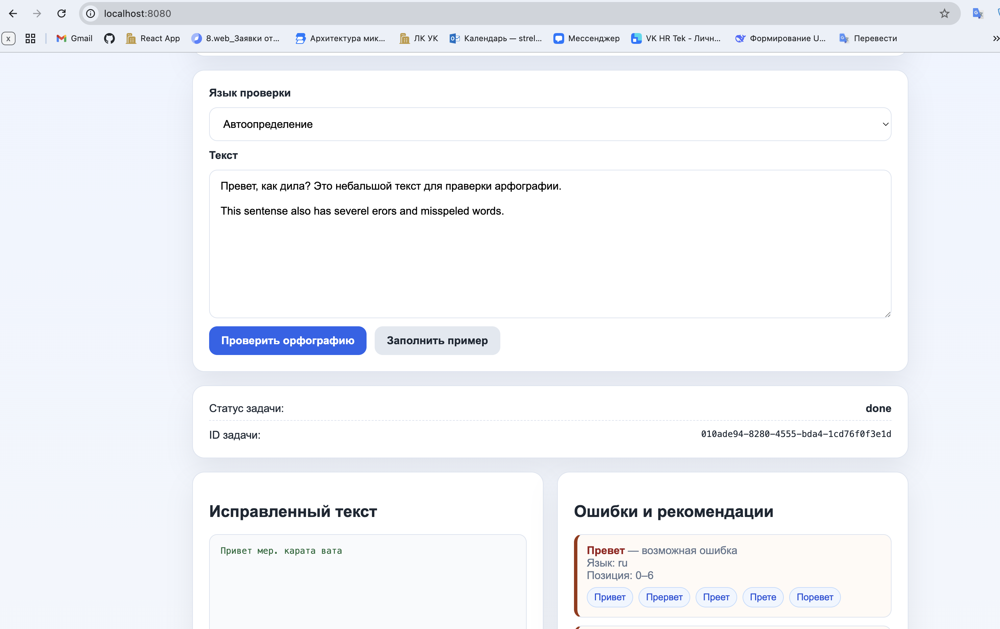
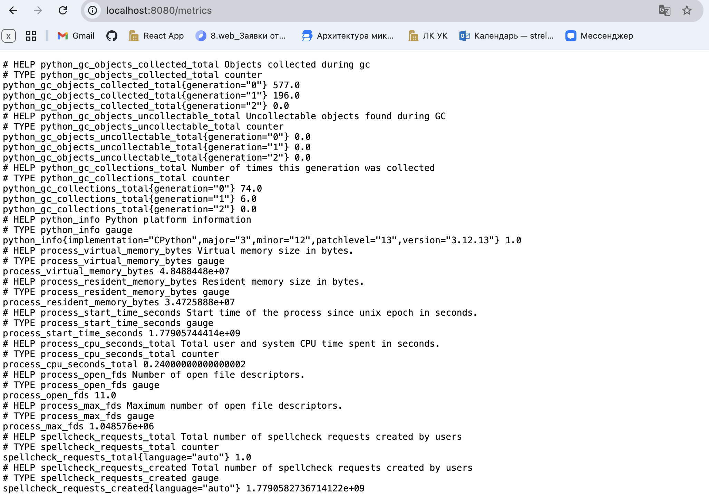
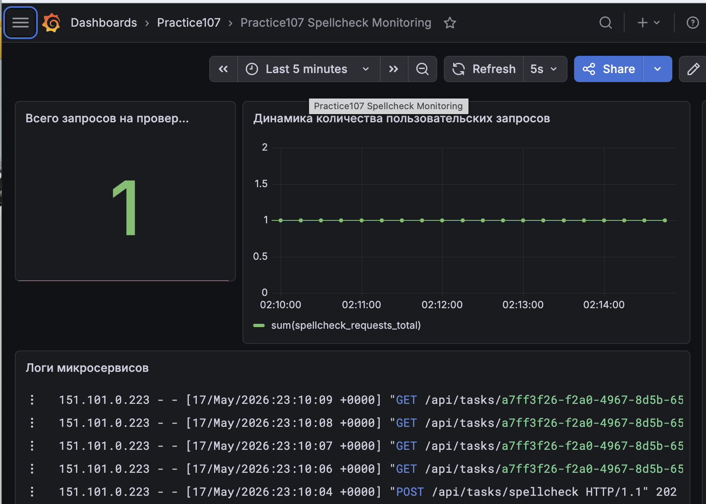

# Сервис проверки орфографии

## Лабораторная работа 105. Микросервисная архитектура

### Описание проекта

Проект представляет собой микросервисное веб-приложение для проверки орфографии текста.

Пользователь вводит текст в веб-интерфейсе, после чего приложение отправляет запрос на проверку орфографии. Проверка выполняется отдельным сервисом `worker`, а результат возвращается пользователю через backend.

### Состав приложения

Приложение состоит из нескольких сервисов:

- `gateway` — Nginx, единая точка входа в приложение;
- `frontend` — пользовательский интерфейс;
- `backend` — Flask API для обработки пользовательских запросов;
- `worker` — сервис фоновой проверки орфографии;
- `docker-compose.yml` — файл для сборки и запуска всех сервисов.

### Структура проекта

```text
StrelnikovaDA/
├── backend/
│   ├── app.py
│   ├── Dockerfile
│   ├── requirements.txt
│   └── test_backend.py
├── frontend/
│   ├── Dockerfile
│   ├── index.html
│   ├── script.js
│   └── style.css
├── gateway/
│   ├── Dockerfile
│   └── nginx.conf
├── worker/
│   ├── app.py
│   ├── Dockerfile
│   ├── requirements.txt
│   ├── test_spellchecker.py
│   ├── dictionaries/
│   └── logic/
├── monitoring/
├── screenshots/
├── docker-compose.yml
└── readme.md
```

### Запуск проекта

Для запуска проекта необходимо перейти в каталог `StrelnikovaDA` и выполнить команду:

```bash
docker compose up --build
```

После запуска приложение доступно по адресу:

```text
http://localhost:8080
```

### Проверка работы приложения

1. Открыть приложение в браузере:

```text
http://localhost:8080
```

2. Ввести текст для проверки орфографии, например:

```text
Превет мир
```

3. Нажать кнопку проверки орфографии.
4. Дождаться результата проверки.

---

## Лабораторная работа 106. Continuous Integration

### Цель работы

Настроить процесс автоматического тестирования входящих изменений при pull request в главную ветку репозитория.

### Описание выполненной работы

Для проекта был настроен CI-процесс с использованием GitHub Actions.

Pipeline выполняет автоматическую проверку проекта при создании или обновлении pull request в ветку `main`.

### Используемая CI/CD-платформа

В качестве CI/CD-платформы используется:

```text
GitHub Actions
```

Workflow расположен в файле:

```text
.github/workflows/ci.yml
```

### Условия запуска pipeline

Pipeline запускается автоматически при pull request в ветку `main`.

```yaml
on:
  pull_request:
    branches: [ "main" ]
```

### Шаги workflow

Pipeline выполняет следующие шаги:

1. Checkout репозитория.
2. Установка Python.
3. Установка зависимостей backend.
4. Установка зависимостей worker.
5. Проверка конфигурации Docker Compose.
6. Сборка Docker-образов проекта.
7. Запуск unit-тестов backend.
8. Запуск unit-тестов worker.

### Проверка успешного выполнения

При корректном проекте все шаги workflow завершаются успешно, а pull request получает зелёный статус проверки.

### Проверка выполнения с ошибкой

Для демонстрации ошибки был временно изменён один из тестов. После этого pipeline завершился с ошибкой, так как тесты не прошли.

После получения скриншота ошибка была исправлена, а финальный запуск CI снова завершился успешно.

### Скриншоты выполнения CI/CD процесса

#### Общий список запусков workflow



#### Успешное выполнение CI



#### Выполнение CI с ошибкой


---

## Лабораторная работа 107. Monitoring

### Цель работы

Изучить подходы к централизованному сбору логов и мониторингу параметров микросервисного приложения.

### Описание выполненной работы

В рамках лабораторной работы было развернуто микросервисное приложение для проверки орфографии на базе проекта из лабораторной работы 105.

Для приложения была настроена система мониторинга и централизованного сбора логов.

Реализовано:

- endpoint `/metrics` в сервисе `backend`;
- прикладная метрика `spellcheck_requests_total`;
- сбор метрик с помощью Grafana Alloy;
- хранение метрик в Grafana Mimir;
- сбор логов контейнеров с помощью Grafana Alloy;
- хранение логов в Loki;
- визуализация логов и метрик в Grafana;
- dashboard для мониторинга приложения.

### Сервисы проекта

Проект состоит из следующих сервисов:

- `gateway` — Nginx, единая точка входа в приложение;
- `frontend` — пользовательский интерфейс;
- `backend` — Flask API, обработка пользовательских запросов;
- `worker` — сервис фоновой проверки орфографии;
- `alloy` — сборщик логов и метрик;
- `loki` — хранилище логов;
- `mimir` — хранилище метрик;
- `grafana` — система визуализации логов и метрик.

### Реализованная прикладная метрика

В сервисе `backend` реализован endpoint:

```text
GET /metrics
```

Он доступен по адресу:

```text
http://localhost:8080/metrics
```

Через этот endpoint публикуется прикладная метрика:

```text
spellcheck_requests_total
```

Метрика показывает общее количество пользовательских запросов на проверку орфографии.

Пример значения метрики:

```text
spellcheck_requests_total{language="auto"} 1.0
```

Метрика увеличивается каждый раз, когда пользователь отправляет текст на проверку орфографии.

### Сбор метрик

Grafana Alloy опрашивает backend по адресу:

```text
http://backend:8000/metrics
```

Полученные метрики отправляются в Grafana Mimir.

В Grafana для отображения метрик используется datasource:

```text
Mimir
```

### Сбор логов

Grafana Alloy собирает Docker-логи контейнеров микросервисного приложения.

Логи отправляются в Loki.

В Grafana для отображения логов используется datasource:

```text
Loki
```

В dashboard отображаются логи микросервисов:

```text
gateway
frontend
backend
worker
```

### Визуализация в Grafana

В Grafana создан dashboard:

```text
Practice107 Spellcheck Monitoring
```

Dashboard содержит:

- общее количество запросов на проверку орфографии;
- динамику количества пользовательских запросов;
- логи микросервисов.

Grafana доступна по адресу:

```text
http://localhost:3000
```

Данные для входа:

```text
login: admin
password: admin
```

### Файлы мониторинга

Конфигурация мониторинга расположена в каталоге:

```text
monitoring/
```

Основные файлы:

```text
monitoring/alloy/config.alloy
monitoring/loki/config.yml
monitoring/mimir/config.yml
monitoring/grafana/provisioning/datasources/datasources.yml
monitoring/grafana/provisioning/dashboards/dashboards.yml
monitoring/grafana/dashboards/spellcheck-dashboard.json
```

### Запуск проекта

Для запуска проекта необходимо перейти в каталог `StrelnikovaDA`:

```bash
cd StrelnikovaDA
```

Затем выполнить команду:

```bash
docker compose up --build
```

После запуска доступны:

```text
Приложение: http://localhost:8080
Метрики:     http://localhost:8080/metrics
Grafana:     http://localhost:3000
```

### Проверка работоспособности

Для проверки необходимо выполнить следующие действия:

1. Открыть приложение:

```text
http://localhost:8080
```

2. Ввести текст для проверки орфографии, например:

```text
Превет мир
```

3. Нажать кнопку проверки орфографии.

4. Открыть endpoint метрик:

```text
http://localhost:8080/metrics
```

5. Убедиться, что отображается метрика:

```text
spellcheck_requests_total{language="auto"} 1.0
```

6. Открыть Grafana:

```text
http://localhost:3000
```

7. Перейти в dashboard:

```text
Dashboards → Practice107 → Practice107 Spellcheck Monitoring
```

8. Убедиться, что отображаются:

- значение метрики `spellcheck_requests_total`;
- график пользовательских запросов;
- логи микросервисов.

### Скриншоты выполнения Monitoring

#### Приложение



#### Endpoint `/metrics`



#### Dashboard Grafana



### Результат

После запуска командой:

```bash
docker compose up --build
```

---

## Лабораторная работа 108. Secure CI

### Цель работы

Изучить подходы к встраиванию автоматических проверок безопасности в процесс сборки и проверки программного проекта.

### Описание выполненной работы

В рамках лабораторной работы был настроен Secure CI pipeline для микросервисного приложения проверки орфографии.

CI-процесс реализован с использованием GitHub Actions.

Pipeline автоматически запускается при:

- `push` в ветку `main`;
- `push` в ветку `strelnikova_da_108_lab`;
- `pull request` в ветку `main`;
- ручном запуске через `workflow_dispatch`.

Workflow расположен в файле:

```text
.github/workflows/secure-ci.yml
```

### Состав Secure CI pipeline

Pipeline состоит из нескольких job:

1. `tests` — запуск автотестов;
2. `static-analysis` — статический анализ исходного кода;
3. `dependency-security` — проверка безопасности зависимостей;
4. `secret-scan` — поиск секретов в репозитории.

### Автотесты

В job `tests` выполняется установка зависимостей проекта и запуск unit-тестов:

```text
backend/test_backend.py
worker/test_spellchecker.py
```

Для запуска тестов используются команды:

```bash
python -m unittest -v test_backend.py
python -m unittest -v test_spellchecker.py
```

### Статический анализ исходного кода

Для статического анализа используется инструмент:

```text
Bandit
```

Bandit выполняет проверку Python-кода сервисов:

```text
backend
worker
```

Тестовые файлы исключены из анализа, так как они не являются production-кодом.

Команда проверки:

```bash
bandit -r backend worker -x backend/test_backend.py,worker/test_spellchecker.py -ll
```

### Поиск секретов в репозитории

Для поиска секретов используется инструмент:

```text
Gitleaks
```

Gitleaks проверяет репозиторий на наличие:

- токенов;
- паролей;
- API-ключей;
- других чувствительных данных.

Проверка выполняется автоматически в job:

```text
secret-scan
```

### Проверка безопасности зависимостей

Для проверки Python-зависимостей используется:

```text
pip-audit
```

Проверяются зависимости сервисов:

```text
backend/requirements.txt
worker/requirements.txt
```

Команды проверки:

```bash
pip-audit -r backend/requirements.txt
pip-audit -r worker/requirements.txt
```

### Результат

После настройки Secure CI pipeline проект автоматически проверяется при push и pull request.

Pipeline выполняет:

- установку зависимостей;
- запуск автотестов;
- статический анализ кода;
- поиск секретов;
- проверку зависимостей на известные уязвимости.

Если один из этапов завершается с ошибкой, весь pipeline считается неуспешным.